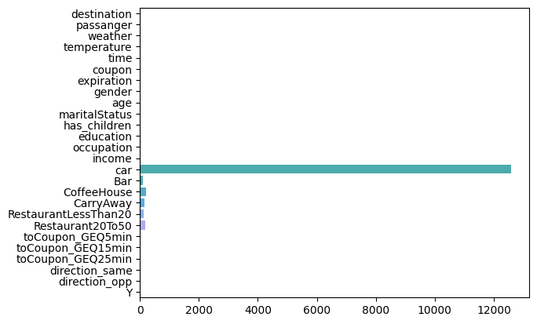

# Missing Data

The original dataset has some columns which are missing a lot of data. There are 12,684 rows in the original dataset. The column `car` is missing in 12,576 of them making this column useless for our analysis. Other columns like `Bar`, `CoffeeHouse`, `CarryAway`, `RestaurantLessThan20` and `Restaurant20To50` are missing between 107 and 217 times - these columns can still be used for our analysis.

The bar graph for the data completeness is -  

To deal with this, I choose to ignore and remove the `car` column and use all the other rows.

# Basic Analysis

## Number of people accepting coupons

Around 58% of all respondents accepted the coupon(7,210 accepted and the remaining did not accept the coupon)

## Showing relationship between Y and some columns

An easy way to see corelation between different columns and the likelihood to accept a coupon are by creating barplots for different columns and coloring the graphs by the value of Y(acceptance of the coupon). Doing this gave me a quick understanding of the data and different potential co-relations.

## Creating segments

The assignment guided us to create segments of the dataset and try to determine if those segments were more or less likely to accept the coupons provided. The assignment guided us through analyzing the bar coupons and checking different segments like "how often does the customer drink out at a bar", "do they have kids in the car with them", "how much do they usually spend". Knowing things like this can help us target customers with better coupons which they are more likely to accept.

In each of these examples, we treated the total population as the control group. We should be aiming to target customers who are at least 15% more likely to accept the coupon.

# Analyzing Coupons for High End Restaurants

I chose to analyze `Restaurant(20-50)` coupons for the self directed part of the assignment

There are 1492 coupons of this type of which around 44% were accepted.

## Basic Analysis

A quick and easy analysis of the data shows the relation between people who accepted the data and some of the columns which might give us an indication of which customers might be more interested in a coupon.

I tried to use the columns `['weather', 'temperature', 'income', 'education', 'direction_same', 'direction_opp']` to find segments and the results are -

1. People are just as willing to accept the coupon when the weather is sunny as the normal population at about 46%
2. People earning more than $50k a year are also just as likely to accept as the general population at 45%
3. People who are already travelling in the direction of the restaurant are 46% likely to accept the coupon
4. People who eat at more expensive restaurants more than 4 times a month are more likely to accept the coupon at 64%

All of these random segments do not show much deviation from the total population so we might need to combine some of these to find a better segment.

1. People in a higher income bracket are not any more likely to accept a coupon than the general population

Nothing can explain people accepting the coupon as much as how many times they already visit more expensive restaurants.

# Final takeaways

From the looks of the data, the most telling column in both the case of the bar coupon and the restaurant coupon is the frequency with which the person already goes to these activities - if a person already goes to a bar often in a month, they are much more likely to accept a coupon for a bar. The same holds for people who enjoy eating at expensive restaurants. The other factors play a role but the largest explainer of behaviour comes from these factors.